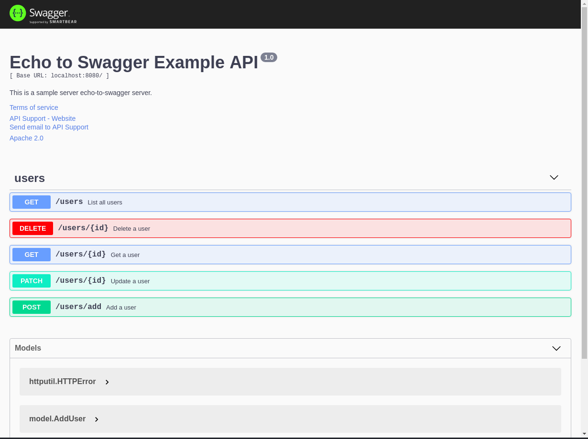

# Echo to Swagger Sample

This project is using [Echo](https://echo.labstack.com/) framework as another demonstration of using [Swag](https://github.com/swaggo/swag) package to convert Go annotations to Swagger Documentation 2.0.

> For simplicity reasons, this repo doesn't use any database or local storage.

## Dependencies

- Go 1.12.6 or newer
- Swag

## Installation

- Get `swag`

```go
$ go get -u github.com/swaggo/swag/cmd/swag
```

- Add `swag` to PATH

```bash
$ export PATH=$PATH:$GOPATH/bin
```

## How to use this repo

- First clone this repo by opening Terminal and executing this command:

```
$ git clone https://github.com/gamertense/echo-to-swagger
```

- Run `swag init` command:

```
$ cd echo-to-swagger
$ swag init
```

See generated `swagger.yaml` and the rest in `echo-to-swagger/docs` folder.


